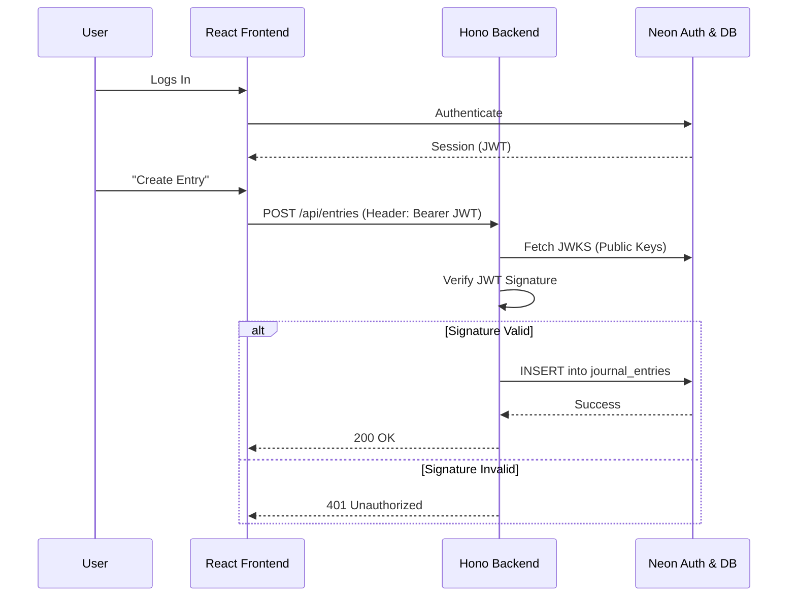

<picture>
  <source media="(prefers-color-scheme: dark)" srcset="https://neon.com/brand/neon-logo-dark-color.svg">
  <source media="(prefers-color-scheme: light)" srcset="https://neon.com/brand/neon-logo-light-color.svg">
  
</picture>

# Custom Backend with Neon Auth: React + Hono

A complete example of a decoupled full-stack application. It features a standalone **React frontend** and a custom **Hono backend API**, secured by **Neon Auth**.

---

This repository demonstrates the **"Bring Your Own Backend"** pattern. Instead of relying on full-stack meta-frameworks, we separate the client and server completely:

1.  **Identity (Neon Auth):** Handles authentication and issues JWTs.
2.  **Frontend (React):** Manages the UI and user session.
3.  **Backend (Hono):** A Node.js API that verifies JWTs and persists data to Neon.

Follow the full guide on [Neon Guides: Building a secure React Backend with Neon Auth and Hono](https://neon.com/guides/react-neon-auth-hono).

## 📂 Project Structure

-   [**`/journal-backend`**](./journal-backend) - A Hono API that verifies tokens and connects to the database.
-   [**`/journal-frontend`**](./journal-frontend) - A React SPA that handles login and API consumption.

## 🚀 Quick Start

### Create a Neon Project
1.  Go to the [Neon Console](https://console.neon.tech).
2.  Create a new project.
3.  **Enable Auth** in the Auth tab.
4.  Copy your **Auth URL** and **Database Connection String**.

### Setup the Backend
Navigate to the backend folder, install dependencies, and run migrations.

```bash
cd journal-backend
npm install

# Add your .env file (see backend README)
npx drizzle-kit migrate
npm run dev
```

### 3. Setup the Frontend
Open a new terminal, navigate to the frontend folder, and start the UI.

```bash
cd journal-frontend
npm install

# Add your .env file (see frontend README)
npm run dev
```

Open `http://localhost:5173` in your browser to access the app.

<p align="left">
    
</p>

## ⚙️ Architecture



## 📚 Learn more

- [Neon Auth Overview](https://neon.com/docs/auth/overview)
- [Neon Auth JWT Plugin](https://neon.com/docs/auth/guides/plugins/jwt)
- [React with Neon Auth UI (UI Components)](https://neon.com/docs/auth/quick-start/react-router-components)
- [Use Neon Auth with React (API methods)](https://neon.com/docs/auth/quick-start/react)
- [Neon JavaScript SDK (Auth & Data API)](https://neon.com/docs/reference/javascript-sdk)
- [Connect a Hono application to Neon](https://neon.com/docs/guides/hono)
